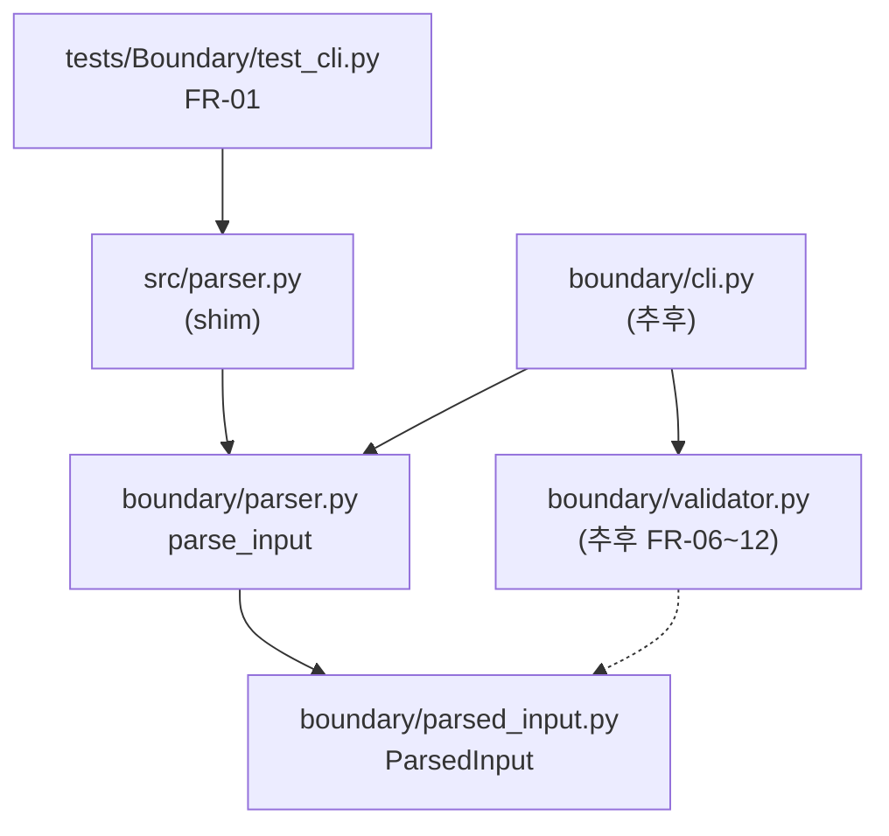

# PRD 작성 및 레거시 코드 갭 분석
_Exported on 6/5/2026 at 13:19:16 GMT+9 from Cursor (3.6.31)_

---

**User**

@README.md  를 참고하여   PRD를 작성하고자 합니다.
@README.md @UnitConverter.py 레거시코드스멜과PRD 갭을목록으로정리해줘.


---

**Cursor**

README와 `UnitConverter.py`를 읽고 프로젝트 구조를 확인한 뒤, 레거시 코드 스멜과 PRD 갭을 정리하겠습니다.


`README.md`가 목표 상태(요구사항)를 정의하고, `UnitConverter.py`는 37줄짜리 단일 스크립트 레거시입니다. PRD 작성에 바로 쓸 수 있도록 **레거시 코드 스멜**과 **PRD/README 갭**을 정리했습니다.

---

## 1. `UnitConverter.py` 레거시 코드 스멜

| # | 스멜 유형 | 현상 | 해당 코드 / 설명 |
|---|-----------|------|------------------|
| 1 | **God Function / SRP 위반** | 입력·검증·변환·출력이 `main()` 한 함수에 모두 있음 | ```1:32:c:\0604_AI\UnitConverter_02\UnitConverter.py``` |
| 2 | **Magic Number 반복** | `3.28084`, `1.09361`이 입력 변환·출력 변환에 각각 하드코딩 (총 4회) | ```16:28:c:\0604_AI\UnitConverter_02\UnitConverter.py``` |
| 3 | **OCP 위반 (Switch/If-Else 체인)** | 단위 추가 시 `elif` 분기와 출력 줄을 모두 수정해야 함 | ```16:32:c:\0604_AI\UnitConverter_02\UnitConverter.py``` |
| 4 | **개방-확장 구조 부재** | 클래스·인터페이스·전략 패턴 없음 — README의 OCP/SRP 요구와 정반대 | 전체 파일 |
| 5 | **테스트 불가능한 설계** | `input()` / `print()`에 직접 결합, 순수 변환 로직 분리 없음 | ```2:2```, ```30:32``` |
| 6 | **단일 책임·모듈 분리 없음** | 프로젝트에 `UnitConverter.py` 단일 파일만 존재 (테스트·설정 파일 없음) | 저장소 구조 |
| 7 | **중복 변수 / Dead naming** | `meter_value`와 `in_meters`가 동일 의미로 중복 | ```26:27:c:\0604_AI\UnitConverter_02\UnitConverter.py``` |
| 8 | **불완전한 입력 검증** | 형식·숫자·미지 단위만 처리; **음수 검증 없음** (README 품질 요구 미충족) | ```10:24``` |
| 9 | **엣지 케이스 미처리** | `meter:`, `:2.5`, 공백(`meter : 2.5`), 빈 입력 등 미정의 | ```8:8``` (`split`만 수행) |
| 10 | **출력 정밀도 불일치** | README 예시는 `8.2 feet`, `2.7 yard`(소수 1자리); 코드는 전체 float 출력 | README 34–36행 vs ```30:32``` |
| 11 | **확장 포인트 부재** | 외부 설정(JSON/YAML), 동적 단위 등록, 출력 포맷 선택 — README 추가 요구 전부 미구현 | README 58–64행 |
| 12 | **관심사 혼재 (I/O + 도메인)** | CLI 프롬프트 문자열이 비즈니스 로직과 같은 레벨에 존재 | ```2:2``` |

---

## 2. PRD 갭 (README 목표 vs 현재 구현 vs PRD에서 보완할 항목)

### A. 기능 갭 — README에 있으나 코드에 없음

| # | README 요구 | 현재 `UnitConverter.py` | PRD에 명시할 내용 |
|---|-------------|-------------------------|-------------------|
| F1 | OCP 설계 | if/elif + 하드코딩 | 단위별 변환기 인터페이스, 레지스트리/팩토리 구조 |
| F2 | SRP 클래스 구성 | 단일 `main()` 함수 | Parser / Validator / Converter / Formatter / Registry 역할 분리 |
| F3 | 음수 입력 검증 | 없음 | 음수 시 에러 메시지·종료 코드·재입력 여부 |
| F4 | 단위 변환 테스트 | 테스트 파일 없음 | pytest 등 TC 범위·정확도 허용 오차 |
| F5 | 설정 외부화 (JSON/YAML) | 비율 하드코딩 | 설정 파일 스키마, 기본값, 로드 실패 시 동작 |
| F6 | 동적 단위 등록 (`1 cubit = 0.4572 meter`) | 없음 | 등록 문법, 저장 위치(메모리/파일), 세션 지속 여부 |
| F7 | 출력 포맷 (JSON / CSV / 표) | 고정 `print` 텍스트 | 포맷 선택 방법(CLI 옵션·프롬프트), 각 포맷 스키마 |
| F8 | feet/yard 비율을 meter 기반 계산 | 개념은 맞으나 상수 4곳 중복 | **기준 단위(base unit) 1개** + 파생 비율 단일 정의 원칙 |

### B. 동작/UX 갭 — README 예시와 코드 동작 불일치

| # | README | 코드 | PRD 보완 필요 |
|---|--------|------|---------------|
| U1 | `2.5 meter = 8.2 feet` (반올림) | `8.2021...` 전체 출력 | 소수 자릿수·반올림 규칙 (예: 소수 1자리, banker's rounding 등) |
| U2 | 입력 단위 제외하고 “다른 모든 단위” 출력 | 입력 단위도 `meter` 줄로 다시 출력 | **소스 단위 포함/제외** 정책 |
| U3 | `yard` (단수) | `yard` 사용 | 단위 표기 규칙 (단수/복수, 약어) |
| U4 | `meter:2.5` 형식 | 동일 | 대소문자(`Meter`/`METER`), 공백 허용 여부 |

### C. PRD/README 자체의 모호함 (PRD 작성 시 반드시 정의)

README는 **무엇을** 만들지는 적혀 있지만, PRD에는 **어떻게**가 빠져 있습니다.

| # | 모호한 항목 | PRD에 정의할 질문 |
|---|-------------|-------------------|
| P1 | 동적 등록 UX | 별도 명령(`register cubit:0.4572 meter`)인지, 시작 시 설정 파일만인지 |
| P2 | 설정 파일 위치·이름 | `config.json` 기본 경로, CLI `--config` 지원 여부 |
| P3 | 출력 포맷 선택 | 실행 인자(`--format json`) vs 대화형 선택 |
| P4 | 등록 단위 영속성 | 프로그램 종료 후 유지 여부, `config`에 merge 여부 |
| P5 | 에러 처리 정책 | 검증 실패 시 exit code, 재시도, 로그 레벨 |
| P6 | 변환 정확도 | float 허용 vs `Decimal` 사용, TC 허용 오차 (예: `1e-6`) |
| P7 | 지원 단위 초기 목록 | meter/feet/yard 고정 + 확장만 vs 완전 사용자 정의 |
| P8 | 비기능 요구 | Python 최소 버전, 의존성(pyyaml 등), 디렉터리 구조 |
| P9 | CLI vs 라이브러리 | `python UnitConverter.py`만 vs import 가능 모듈 API |
| P10 | Activities(6h) 범위 | PRD MVP vs Phase 2(추가 요구) 우선순위·일정 매핑 |

---

## 3. PRD 작성용 요약 매트릭스

| 영역 | README | 레거시 | PRD 우선순위 |
|------|--------|--------|--------------|
| 핵심 변환 (meter/feet/yard) | ✅ | ⚠️ 동작은 함, 구조·정밀도 문제 | P0 — 리팩터 + 정밀도 규칙 |
| 입력 검증 (형식/숫자/단위) | ✅ | ⚠️ 부분 | P0 — 음수·엣지 케이스 추가 |
| OCP / SRP | ✅ | ❌ | P0 — 아키텍처 요구사항 |
| 단위 테스트 | ✅ | ❌ | P0 |
| 설정 외부화 | ✅ (추가) | ❌ | P1 |
| 동적 단위 등록 | ✅ (추가) | ❌ | P1 |
| 출력 포맷 선택 | ✅ (추가) | ❌ | P1 |

---

## 4. PRD 초안에 넣기 좋은 “현재→목표” 한 줄

> **As-Is:** 37줄 단일 스크립트, 하드코딩 비율, if/elif 분기, stdin/stdout 고정, 테스트·설정·확장 기능 없음.  
> **To-Be (README 기준):** 기준 단위 기반 확장 가능 변환 엔진 + 검증 계층 + 외부 설정 + 동적 등록 + 다중 출력 포맷 + 테스트로 보장된 정확도.

---

PRD 본문(목적, 사용자 스토리, 기능/비기능 요구, 수용 기준, MVP 범위) 초안까지 작성해 드릴 수 있습니다. Agent 모드로 전환하시면 파일로도 정리할 수 있습니다.

---

**User**

PRD  폴더를 만들어서 위 PRD md 파일로 저장

---

**Cursor**

PRD 폴더를 만들고 이전 분석을 바탕으로 PRD 마크다운 파일을 작성합니다.


`PRD` 폴더를 만들고 PRD 문서를 저장했습니다.

**경로:** [PRD/unit-converter-prd.md](c:\0604_AI\UnitConverter_02\PRD\unit-converter-prd.md)

문서에 포함된 내용:

1. **개요** — As-Is / To-Be, 목적
2. **사용자 스토리** — P0/P1 우선순위
3. **기능 요구사항** — 기본 변환, 입력 검증, OCP/SRP, 설정 외부화, 동적 등록, 출력 포맷
4. **비기능 요구사항** — Python 버전, 정확도, exit code
5. **레거시 코드 스멜** — `UnitConverter.py` 10항목
6. **PRD 갭 분석** — README vs 레거시 vs PRD 보완 결정
7. **수용 기준** — MVP(P0) / 추가(P1) 체크리스트
8. **일정** — README Activities 6시간 매핑
9. **Out of Scope** — Phase 2 항목

README에서 모호했던 항목(반올림 규칙, 소스 단위 출력 제외, 설정 스키마, CLI 옵션 등)도 PRD에서 명시해 두었습니다. 수정이나 영문 버전이 필요하면 알려주세요.

---

**User**

아래 예시를 참고하여 PRD → 테스트추적표를 만들어서 PRD 에 추가해주세요
모든FR / NFR 에테스트ID 를1:1 로매핑한다—개념(PRD)에서코드(Test)까지추적가능하게.
ID
요구
Given
Then
P
FR-01
meter:2.5 파싱
유효문자열
value=2.5, unit=meter
P0
FR-02
전단위출력
meter 2.5
feet≈8.2021, yard≈2.7340
P0
FR-03
미지단위
cubit:1 (미등록)
명확한오류
P0
FR-04
음수
meter:-1
거부/ 예외
P0
FR-05
잘못된형식
meter / abc
형식오류
P0
NFR-01
OCP
inch 추가
기존변환기코드비수정
P0
NFR-02
SRP
—
Parser / Registry / Converter / Printer 분리
P0
EXT-01
설정파일
units.json
비율로드
P1
EXT-02
동적등록
1 cubit = 0.4572 m
즉시변환가능
P1
EXT-03
출력포맷
--format
json / csv / table 포맷별검증
P1

---

**Cursor**

PRD의 FR/NFR을 확인한 뒤, 예시 형식에 맞춰 테스트 추적표를 작성해 PRD에 추가합니다.


PRD의 FR/NFR을 1:1 테스트 ID로 매핑한 추적표를 작성해 PRD에 추가하고, 요구사항 섹션에 ID를 부여합니다.


FR/NFR ID 표를 보강하고, 중복 `<details>` 블록을 제거한 뒤 테스트 추적표 섹션을 추가합니다.


PRD에 **§8 테스트 추적표**를 추가했습니다. 문서 버전은 1.1입니다.

### 추가 내용 요약

**§3 요구사항 ID 부여**
- `FR-01 ~ FR-12` — 기본 변환 + 입력 검증
- `NFR-01 ~ NFR-03` — OCP / SRP / 테스트 가능성 (§3.3)
- `NFR-04 ~ NFR-08` — Python 버전, 정확도, exit code 등 (§4)
- `EXT-01 ~ EXT-09` — 설정·동적 등록·출력 포맷 (P1)

**§8 테스트 추적표 (1:1 매핑)**

| 구분 | Req ID | Test ID | 건수 |
|------|--------|---------|------|
| FR | FR-01 ~ FR-12 | TC-FR-01 ~ TC-FR-12 | 12 |
| NFR | NFR-01 ~ NFR-08 | TC-NFR-01 ~ TC-NFR-08 | 8 |
| EXT | EXT-01 ~ EXT-09 | TC-EXT-01 ~ TC-EXT-09 | 9 |
| **합계** | — | — | **29** |

각 행에 **Given / Then / P / Test File**을 포함해 `Req ID → Test ID → tests/*.py` 경로로 PRD에서 테스트 코드까지 추적할 수 있습니다.

**§8.6**에는 Test File → Test ID 역추적표도 포함했습니다.

예시와의 대응:
- `FR-01` 파싱, `FR-02` 전 단위 출력, `FR-08` 음수, `FR-09` 미지 단위, `FR-06` 형식 오류
- `NFR-01` OCP, `NFR-02` SRP
- `EXT-01 ~ EXT-03` 설정·동적 등록·출력 포맷

파일: [PRD/unit-converter-prd.md](c:\0604_AI\UnitConverter_02\PRD\unit-converter-prd.md) §8 참고

---

**User**

지금 생성한 파일에 대하여 report파일을 만들고, Report폴더에 저장해줘
파일이름에는 01_ 로 시작하는 prefix를 추가해줘

---

**Cursor**

PRD 내용을 확인한 뒤 Report 폴더에 `01_` 접두사가 붙은 리포트 파일을 작성합니다.


Report 파일을 생성해 저장했습니다.

**경로:** [Report/01_unit-converter-prd-report.md](c:\0604_AI\UnitConverter_02\Report\01_unit-converter-prd-report.md)

### Report 구성

| § | 내용 |
|---|------|
| 1 | Report 목적 |
| 2 | 분석 대상 (README, UnitConverter.py, PRD) |
| 3 | PRD 문서 구조 요약 (§1~§11) |
| 4 | 요구사항 인벤토리 (FR 12 + NFR 8 + EXT 9 = 29건) |
| 5 | 레거시 코드 스멜 10건 요약 |
| 6 | README → PRD 갭 해소 현황 |
| 7 | 테스트 추적표 1:1 매핑 검증 (29:29) |
| 8 | 구현 우선순위 (Activities 6시간 연계) |
| 9 | 현재 구현 상태 (As-Is) |
| 10 | 결론 및 권장 다음 단계 |
| 11 | 관련 문서 링크 |

파일명은 요청하신 대로 `01_` prefix로 `01_unit-converter-prd-report.md`입니다.

---

**User**

현재 폴더에서 수정된 내용을 커밋하고 푸시 해주세요. 커밋 메시지를 한글로 작성하세요

---

**Cursor**

변경 내용을 확인한 뒤 커밋하고 푸시합니다.


푸시 연결 오류가 있어 재시도합니다.


커밋은 완료되었습니다. 푸시는 GitHub 연결 실패로 반영되지 않았습니다.

### 커밋 완료

| 항목 | 내용 |
|------|------|
| 브랜치 | `RED` |
| 커밋 | `11ed6e8` |
| 메시지 | Unit Converter PRD 및 생성 Report 문서 추가 |
| 변경 파일 | 3개 (+921 lines) |

**포함된 파일**
- `PRD/unit-converter-prd.md`
- `Report/01_unit-converter-prd-report.md`
- `Report/01_unit-converter-prd-report-transcript.md`

### 푸시 실패

```
Failed to connect to github.com port 443
```

현재 환경에서 GitHub(`https://github.com/kongkeonpyo-kr/UnitConverter_02.git`)에 접속할 수 없어 푸시가 중단되었습니다. VPN·프록시·방화벽 설정을 확인한 뒤 아래 명령으로 다시 푸시해 주세요.

```powershell
git push -u origin RED
```

네트워크가 복구되면 Agent 모드에서 다시 푸시해 드릴 수 있습니다.

---

**User**

@PRD/unit-converter-prd.md 의 FR-01와 연결성 및 동작을 확인 할수있는 빈 TC작성, 소스코드는 작성금지

---

**Cursor**

FR-01과 TC-FR-01 요구사항을 PRD에서 확인한 뒤, 구현 없이 연결성·동작 검증용 빈 TC만 작성합니다.


PRD §8.2 기준으로 `tests/test_parser.py`에 FR-01(TC-FR-01) 빈 테스트만 작성합니다.


FR-01과 연결되는 빈 TC를 PRD §8.2 기준으로 작성했습니다. **소스코드(`src/`, `Parser` 등)는 작성하지 않았습니다.**

**파일:** [tests/test_parser.py](c:\0604_AI\UnitConverter_02\tests\test_parser.py)

### PRD ↔ TC 연결

| 항목 | 값 |
|------|-----|
| Req ID | FR-01 |
| Test ID | TC-FR-01 |
| Given | `"meter:2.5"` |
| Then | `unit="meter"`, `value=2.5` |
| PRD § | 3.1, 8.2 |
| Test File | `tests/test_parser.py` |

### TC 구성

- 모듈 docstring에 PRD 추적 정보(FR-01, TC-FR-01, § 참조)
- `@pytest.mark.req("FR-01")` 마커로 요구사항 ID 표시
- `pytest.skip(...)` — Parser 미구현 상태에서 실패 없이 추적만 가능
- Given / When / Then 주석 — 구현 후 연결할 assert 위치 명시

### 실행 확인

```
tests/test_parser.py::test_tc_fr_01_parse_meter_2_5 SKIPPED
```

테스트 1건 수집·스킵 정상 동작을 확인했습니다. Parser 구현 후 `skip`을 제거하고 When/Then 주석의 assert를 활성화하면 FR-01 동작 검증으로 이어집니다.

---

**User**

@PRD/unit-converter-prd.md 를 수정하려고합니다. 아래와 같이  FR들을 도메인 관련 내용과, 바운더리 관련된 내용으로 구분할수있게 정비하세요
 test_converter.py# Domain (Track B)
 test_cli.py# Boundary (Track A)

---

**Cursor**

PRD 전체를 확인한 뒤 FR을 Domain(Track B)과 Boundary(Track A)로 재구성합니다.


FR을 Track A(Boundary)와 Track B(Domain)로 재구성하고, 테스트 추적표와 섹션 번호를 함께 정비합니다.


PRD v1.2로 FR을 **Track A (Boundary)** / **Track B (Domain)** 로 정비했습니다.

### 변경 요약

**§3.1 FR Track 개요** (신규)
- Track B (Domain) → `tests/test_converter.py` — 변환·반올림·표기
- Track A (Boundary) → `tests/test_cli.py` — 파싱·검증·CLI 입출력
- Track 간 데이터 흐름 다이어그램 추가

**§3.2 Track B — Domain** — FR-02 ~ FR-05  
**§3.3 Track A — Boundary** — FR-01, FR-06 ~ FR-12  

| Track | FR | Test File |
|-------|-----|-----------|
| **B (Domain)** | FR-02, FR-03, FR-04, FR-05 | `test_converter.py` |
| **A (Boundary)** | FR-01, FR-06 ~ FR-12 | `test_cli.py` |

**§8 테스트 추적표**
- Track 컬럼 추가, FR 표를 Track B / Track A로 분리
- FR-03, FR-05 Test File: `test_formatter.py` → `test_converter.py`
- FR-01, FR-06~12: `test_parser.py` / `test_validator.py` → `test_cli.py`
- EXT-07~09 (출력 포맷): `test_cli.py` (Boundary)
- §8.5 요약 매트릭스에 Track별 FR 집계 추가
- §8.6 / §8.7 Test File 역추적표 분리

**§7 수용 기준** — Track A/B 기준으로 체크리스트 재작성

섹션 번호도 맞춰 두었습니다: 아키텍처 §3.4, EXT §3.5~3.7.

---

**User**

PRD 수정을 한국어로 커밋하고 푸시 진행

---

**Cursor**

PRD 수정만 스테이징하고 한글 커밋 메시지로 커밋·푸시합니다.


커밋과 푸시가 완료되었습니다.

### 커밋

| 항목 | 내용 |
|------|------|
| 브랜치 | `RED` |
| 커밋 | `cddc55d` |
| 메시지 | PRD v1.2: FR을 Track A(Boundary)와 Track B(Domain)로 정비 |
| 변경 | `PRD/unit-converter-prd.md` (+122 / -84) |

### 푸시

```
origin/RED  11ed6e8..cddc55d
```

원격 저장소에 반영되었습니다.

> 참고: `tests/` 폴더는 아직 untracked 상태입니다. PRD 수정만 커밋했으며, 테스트 파일도 함께 커밋하려면 알려주세요.

---

**User**

@PRD/unit-converter-prd.md 를 참고하여
FR-01 의 Track을 참고하여 Test 파일과 TC까지만 만들고 소스코드는 아직 작성하지 말고, 실패하는 상태로 두세요

---

**Cursor**

PRD에서 FR-01(Track A) 요구사항을 확인한 뒤, 소스 없이 실패하는 TC만 작성합니다.


PRD §3.3·§8.2에 따라 Track A용 `tests/test_cli.py`에 TC-FR-01만 작성하고, 구현 없이 실패하도록 합니다.


FR-01(Track A) 기준으로 테스트 파일과 TC만 추가했습니다. 소스코드는 없으며 **FAILED** 상태입니다.

### 생성 파일

| 파일 | 역할 |
|------|------|
| [tests/test_cli.py](c:\0604_AI\UnitConverter_02\tests\test_cli.py) | Track A — TC-FR-01 |
| [pytest.ini](c:\0604_AI\UnitConverter_02\pytest.ini) | `@pytest.mark.req` 마커 등록 |

### PRD 연결

| 항목 | 값 |
|------|-----|
| Req ID | FR-01 |
| Track | **A (Boundary)** |
| Test ID | TC-FR-01 |
| Given | `"meter:2.5"` |
| Then | `unit="meter"`, `value=2.5` |
| 구현 예정 | `src.parser.parse_input` (미구현) |

### 실행 결과

```
tests/test_cli.py::test_tc_fr_01_parse_meter_2_5 FAILED
ModuleNotFoundError: No module named 'src'
```

Red 단계로, `src/parser.py` 구현 후 `parse_input`을 연결하면 Green으로 전환할 수 있습니다.

---

**User**

@PRD/unit-converter-prd.md 를 참고하여
FR-02 의 Track을 참고하여 Test 파일과 TC까지만 만들고 소스코드는 아직 작성하지 말고, 실패하는 상태로 두세요

---

**Cursor**

FR-02(Track B)용 `tests/test_converter.py`에 TC-FR-02만 추가합니다.


FR-02(Track B) 기준으로 테스트 파일과 TC만 추가했습니다. 소스코드는 없으며 **FAILED** 상태입니다.

### 생성 파일

**[tests/test_converter.py](c:\0604_AI\UnitConverter_02\tests\test_converter.py)** — Track B (Domain)

### PRD 연결

| 항목 | 값 |
|------|-----|
| Req ID | FR-02 |
| Track | **B (Domain)** |
| Test ID | TC-FR-02 |
| Given | `meter`, `2.5`, 기본 Registry |
| Then | `feet`·`yard` 변환 결과 반환, **`meter` 제외** |
| 구현 예정 | `src.registry.UnitRegistry`, `src.converter.Converter` (미구현) |

### 실행 결과

```
tests/test_converter.py::test_tc_fr_02_convert_all_units_excluding_source FAILED
ModuleNotFoundError: No module named 'src'
```

Red 단계입니다. `UnitRegistry.default()`와 `Converter.convert()` 구현 후 Green으로 전환할 수 있습니다.

---

**User**

현재 수정 내용 커밋하고 푸시

---

**Cursor**

커밋과 푸시가 완료되었습니다.

### 커밋

| 항목 | 내용 |
|------|------|
| 브랜치 | `RED` |
| 커밋 | `b77e527` |
| 메시지 | FR-01/FR-02 Track별 Red TC 추가 |
| 변경 파일 | 3개 (+86 lines) |

**포함된 파일**
- `pytest.ini`
- `tests/test_cli.py` (TC-FR-01, Track A)
- `tests/test_converter.py` (TC-FR-02, Track B)

### 푸시

```
origin/RED  cddc55d..b77e527
```

원격 저장소에 반영되었습니다. `tests/__pycache__/`는 커밋에서 제외했습니다.

---

**User**

루트에 .cursorrules 초안을 새로 만들어줘. (현재 없음)
도메인:
- @README.md 참고
아키텍처:
- ECB: boundary→control→entity, entity→* import 금지
- Dual-Track: Logic(entity/control) Domain Mock 금지 / UI(boundary) Mock 허용
- 테스트 ID: D-* (Logic), U-* (UI), 파일명 test_d_* / test_u_*
TDD:
- RED→GREEN→REFACTOR, assert 완화·skip·xfail 금지
- MagicConstant SSOT (34/16 리터럴 산재 금지)
AI 행동:
- 한국어, TDD 시 Phase/Layer/Track 선언
- git commit은 사용자 요청 시만
40~80줄 초안. 다른 파일은 만들지 마.


---

**Cursor**

루트에 [.cursorrules](c:\0604_AI\UnitConverter_02\.cursorrules) 초안을 생성했습니다. (약 55줄)

### 포함 내용

| 섹션 | 요약 |
|------|------|
| **도메인** | README 기준 변환 규칙, OCP/SRP, 검증, P1 확장, PRD 참조 |
| **ECB** | boundary→control→entity, entity 역방향 import 금지 |
| **Dual-Track** | Logic(D-*, `test_d_*`, Mock 금지) / UI(U-*, `test_u_*`, Mock 허용) |
| **TDD** | RED→GREEN→REFACTOR, skip/xfail/assert 완화 금지, MagicConstant SSOT |
| **AI 행동** | 한국어, Phase/Layer/Track 선언, commit은 요청 시만 |
| **디렉터리** | entity/control/boundary + tests 분리 가이드 |

다른 파일은 만들지 않았습니다. ECB 네이밍(`test_d_*`/`test_u_*`)과 기존 `test_cli.py`/`test_converter.py` 정리 시점이 필요하면 알려주세요.

---

**User**

├─ .cursor/
│  ├─ rules/      00-principles · 10-tdd-rules · 20-architecture-ecb ...
│  ├─ skills/     pytest-boundary-test/ · golden-master/ · documentation/
│  └─ commands/   red-test.md · green-minimal.md · refactor-safe.md

위 구조를 참고하여 폴더까지만 만들어주세요

---

**Cursor**

`.cursor/` 하위 폴더 구조만 생성합니다.


---

**User**

.cursor/commands/tdd-red.md 를 새로 만들어줘.
UnitConverter02 Dual-Track TDD — RED 단계만.
구조:
# TDD RED — 실패 테스트 먼저
## 필수 선언 (첫 줄: Phase: red | Layer: ... | Track: ...)
## 절차 (ID 확인 → AAA 테스트 → pytest FAIL)
## pytest 예시 (bash)
## 보고 (테스트 ID, FAIL 요약, 변경 파일 tests/만)
## 금지 (src/ 수정, Domain Mock on Logic Track, assert 완화)
Skill 파일은 만들지 마.


---

**Cursor**

`.cursor/commands/tdd-red.md`를 생성했습니다.

### 구성

| 섹션 | 내용 |
|------|------|
| **필수 선언** | `Phase: RED \| Layer: ... \| Track: Logic\|UI` |
| **절차** | ID 확인 → AAA 테스트(`tests/`만) → pytest FAIL |
| **pytest 예시** | `test_d_*`(Logic), `test_u_*`(UI) 실행 bash |
| **보고** | Test ID, FAIL 요약, 변경 파일(`tests/`만) |
| **금지** | `src/` 수정, Logic Track Domain Mock, assert 완화, skip/xfail |

PRD Track A→UI(`U-*`), Track B→Logic(`D-*`) 매핑도 포함했습니다. Skill 파일은 만들지 않았습니다.

---

**User**

.cursor/commands/review-ecb.md 를 새로 만들어줘.
코드 수정 금지, ECB·계약 위반만 표로 리뷰.
체크: import 방향, Logic Track Domain Mock.


---

**Cursor**

`.cursor/commands/review-ecb.md`를 생성했습니다.

### 구성

| 섹션 | 내용 |
|------|------|
| **필수 선언** | `Phase: REVIEW \| Scope: ECB·계약 \| Action: read-only` |
| **ECB 계약** | boundary→control→entity, Layer별 import 허용/금지 |
| **절차** | import 스캔 → 방향 검증 → Logic Track Mock 스캔 → 표 작성 |
| **위반 표 3종** | ① Import 방향 ② Layer 역할 침범 ③ Logic Track Domain Mock |
| **검색 힌트** | `rg` 예시 (리뷰용, 수정 없음) |
| **금지** | 코드 수정, UI Mock을 위반으로 기록 |

코드 수정 없이 ECB·계약 위반만 표로 보고하도록 정의했습니다.

---

**User**

현재 파일 커밋하고 푸시

---

**Cursor**

커밋과 푸시가 완료되었습니다.

### 커밋

| 항목 | 내용 |
|------|------|
| 브랜치 | `RED` |
| 커밋 | `728b976` |
| 메시지 | Cursor ECB/TDD 설정 및 커맨드 추가 |
| 변경 | 3 files (+258 lines) |

**포함된 파일**
- `.cursor/rules/.cursorrules`
- `.cursor/commands/tdd-red.md`
- `.cursor/commands/review-ecb.md`

### 푸시

```
origin/RED  b77e527..728b976
```

`tests/__pycache__/`는 커밋에서 제외했습니다.

---

**User**

REA 에서 staging으로 현재 작업 머지하는 PR 제목과 내용 간단하게 작성

---

**Cursor**

RED와 staging 간 차이를 확인한 뒤 PR 제목·본문 초안을 작성합니다.


PR 제목과 본문 초안입니다. (브랜치명 `REA` → `RED` 기준)

---

## PR 제목

```
RED → staging: PRD·Report·Red TC·Cursor ECB/TDD 설정 반영
```

---

## PR 본문

```markdown
## Summary

- PRD v1.2 작성 (FR Track A/B, 테스트 추적표 29건)
- PRD 생성 Report 및 transcript 문서 추가
- FR-01(Track A), FR-02(Track B) Red TC 추가 (`tests/test_cli.py`, `tests/test_converter.py`)
- Cursor ECB/TDD 규칙 및 커맨드 (`tdd-red`, `review-ecb`) 추가

## 변경 범위

| 영역 | 내용 |
|------|------|
| PRD/Report | 요구사항·갭 분석·TC 추적표 |
| tests/ | RED 단계 실패 TC 2건 + pytest.ini |
| .cursor/ | .cursorrules, tdd-red.md, review-ecb.md |

## Test plan

- [ ] `python -m pytest tests/ -v` — TC-FR-01, TC-FR-02 FAILED 확인 (구현 전 Red 상태)
- [ ] PRD §8 추적표와 테스트 파일 매핑 일치 확인
```

---

**참고:** `staging`과 `RED` 사이 커밋 4개, +1,303 lines, 구현 코드(`src/` 등)는 포함되지 않았습니다.

현재 브랜치는 `RED`입니다. 터미널에서 아래 명령을 실행하면 `RED` 기준으로 `GREEN` 브랜치가 생성되고 이동합니다.

```powershell
git checkout -b GREEN
```

원격에도 올릴 경우:

```powershell
git push -u origin GREEN
```

Agent 모드에서 제가 직접 실행하려면 명령 승인(Approve)이 필요합니다. 승인해 주시면 다시 진행하겠습니다.

---

**User**

현재 브랜치에서  GREEN/FR-01 브랜치 생성후 이동

---

**Cursor**

FR-03 요구사항과 기존 테스트 패턴을 확인한 뒤 RED 스켈레톤만 작성합니다.


Phase: RED | Layer: entity/control | Track: Logic

FR-03 RED 스켈레톤을 `tests/test_converter.py`에 추가했습니다. 구현 코드는 작성하지 않았습니다.

### 추가 TC

| 항목 | 값 |
|------|-----|
| Req ID | FR-03 |
| Dual-Track | **Logic** (PRD Track B — Domain) |
| Test ID | `D-FR-03` / `TC-FR-03` |
| Given | `meter`, `2.5` |
| Then | `"8.2 feet"`, `"2.7 yard"` (round half up) |
| RED 방식 | `pytest.fail(...)` |

### 변경 파일

- `tests/test_converter.py` — `test_d_fr03_round_half_up_one_decimal` 추가
- `pytest.ini` — `@pytest.mark.track` 마커 등록

### 실행 결과

```
test_d_fr03_round_half_up_one_decimal FAILED
Failed: RED: FR-03 GREEN 미구현 — Then ['8.2 feet', '2.7 yard'] (round half up)
```

GREEN 단계에서 주석 처리된 Act/Assert를 연결하고 `pytest.fail`을 제거하면 됩니다.

---

**User**

mcp를 이용해서 https://github.com/kimaro0512/UnitConverter_5/pull/1  리뷰 진행

---

**Cursor**

GitHub MCP 도구 스키마를 확인한 뒤 PR #1을 조회·리뷰합니다.


MCP로 PR 정보를 수집했습니다. 리뷰 코멘트를 GitHub에 등록합니다.


[MCP 리뷰 완료 — PR #1](https://github.com/kimaro0512/UnitConverter_5/pull/1)

**PR:** `spec` → `staging`  
**제목:** SPEC 단계 산출물 추가: PRD 갭 분석·아키텍처·TC 추적성  
**변경:** +489 lines, 4 files, 커밋 1개 (`0b962f8`)  
**CI:** check runs 없음  
**머지 상태:** `mergeable_state: clean`

GitHub에 리뷰 코멘트도 등록했습니다.

---

## 총평

| 항목 | 판정 |
|------|------|
| SPEC 단계 적합성 | **적합** — 문서만 추가, 레거시 `UnitConverter.py` 유지 |
| 문서 간 일관성 | **양호** — 3개 문서 상호 링크·갭→FR/NFR 교차 참조 |
| 머지 권고 | **승인 가능** (비차단 개선 4건 권고) |

---

## 변경 파일 리뷰

| 파일 | 역할 | 평가 |
|------|------|------|
| `LEGACY-SMELLS-AND-PRD-GAP.md` | 스멜 20건 + 갭 A~D + Mom Test | 체계적, 워크샵 1단계(Activity)에 부합 |
| `docs/ARCHITECTURE.md` | OCP/SRP 패키지 설계 SPEC | 레이어·Protocol·import 방향 명확 |
| `tests/traceability/REQ_TRACEABILITY.md` | FR/NFR ↔ 모듈 ↔ TC 매트릭스 | NFR-04 충족 설계, 상태 `designed` 명시 |
| `.gitignore` | Python 실습 환경 | 적절 (`__pycache__`, `venv`, `.pytest_cache`) |

---

## 강점

1. **Mom Test 관점 PRD 갭** — C4(Problem Statement 없음), D4(제품 vs 실습 혼재) 등 README 자체 빈틈까지 문서화.
2. **아키텍처 SPEC 명확** — `conversion`이 `input`/`output`/`cli`를 import하지 않는다는 규칙이 ECB와 유사.
3. **추적성 3단 구조** — README → FR/NFR → 모듈 → TC 제안명 → Activities 체크리스트.
4. **구현 전 단계 고지** — ARCHITECTURE·REQ_TRACEABILITY 모두 “코드 없음” 명시.

---

## 개선 권고 (비차단)

| # | 이슈 | 권고 |
|---|------|------|
| 1 | **FR ID 의미** | ARCHITECTURE: FR-03=초기 단위, FR-11=반올림. 팀 내 FR 번호 체계를 README와 고정해 두면 RED/GREEN 추적 시 혼선 방지. |
| 2 | **비전 갭 C1** | `unit-converter.jpg`(범용) vs README(길이 CLI). ARCHITECTURE에 **In Scope / Out of Scope** 1문단 추가 권장. |
| 3 | **TC 실증** | 매트릭스 전부 `designed`. RED 단계에서 `tests/unit/test_parser.py` 스켈레톤 1~2건이 있으면 NFR-04 실증 강화. |
| 4 | **config 경로** | repo root `config/units.json` vs `unit_converter/config/` — 한 경로로 확정 필요. |

---

## 체크리스트

- [x] 구현 코드 미포함 (의도대로 SPEC만)
- [x] 레거시 스멜·PRD 갭 분석 완료
- [x] OCP/SRP 목표 구조·import 방향 정의
- [x] FR/NFR 추적성 매트릭스
- [ ] CI/pytest workflow 없음 (GREEN 단계에서 검토)
- [ ] `pyproject.toml` — ARCHITECTURE 트리에 있으나 본 PR 미포함 (다음 PR 예상)

---

## UnitConverter_02 대비 참고

같은 워크샵 맥락의 `_02` 저장소는 PRD v1.2 + Track A/B + `test_cli`/`test_converter` Red TC까지 진행된 상태입니다. `_5`는 **SPEC 문서화**에 집중, `_02`는 **PRD·TC 실행**에 더 가깝습니다. 팀 간 FR 번호·Track 명명 통일을 권장합니다.

추가로 `REQUEST_CHANGES` 리뷰를 GitHub에 올리거나, 특정 파일 라인 코멘트가 필요하면 알려주세요.

---

**User**

@PRD/unit-converter-prd.md FR-04  pytest RED 스켈레톤만작성해줘. 구현은금지. Dual-Track 표기준, pytest.fail 사용.

---

**Cursor**

Phase: RED | Layer: entity/control | Track: Logic

FR-04 RED 스켈레톤을 `test_converter.py`에 추가합니다.


Phase: RED | Layer: entity/control | Track: Logic

FR-04 RED 스켈레톤을 `tests/test_converter.py`에 추가했습니다. 구현 코드는 작성하지 않았습니다.

### 추가 TC

| 항목 | 값 |
|------|-----|
| Req ID | FR-04 |
| Dual-Track | **Logic** (PRD Track B — Domain) |
| Test ID | `D-FR-04` / `TC-FR-04` |
| Given | `feet`, `3.28084` |
| Then | `yard ≈ 1.0` (meter 경유, 허용 오차 `1e-4`) |
| RED 방식 | `pytest.fail(...)` |

### 실행 결과

```
test_d_fr04_derived_conversion_via_meter FAILED
Failed: RED: FR-04 GREEN 미구현 — feet:3.28084 → yard≈1.0 (meter 경유)
```

GREEN 단계에서 주석 처리된 Act/Assert를 활성화하고 `pytest.fail`을 제거하면 됩니다.

---

**User**

@PRD/unit-converter-prd.md FR-04  pytest RED 스켈레톤만작성해줘. 구현은금지. Dual-Track 표기준, pytest.fail 사용.

---

**Cursor**

Phase: RED | Layer: entity/control | Track: Logic

**FR-04 RED 스켈레톤은 이미 `tests/test_converter.py`에 있습니다.** 요청 조건(Dual-Track, `pytest.fail`, 구현 금지)을 모두 충족합니다.

### 기존 TC 위치

```82:114:c:\0604_AI\UnitConverter_02\tests\test_converter.py
# ---------------------------------------------------------------------------
# Req ID  : FR-04
# Track   : Logic (PRD Track B — Domain)
# Test ID : D-FR-04 / TC-FR-04
# ...
@pytest.mark.req("FR-04")
@pytest.mark.track("Logic")
def test_d_fr04_derived_conversion_via_meter():
    ...
    pytest.fail(
        f"RED: FR-04 GREEN 미구현 — feet:{value} → yard≈{expected_yard} (meter 경유)"
    )
```

### PRD 매핑

| 항목 | 값 |
|------|-----|
| Req ID | FR-04 |
| Track | **Logic** (PRD Track B) |
| Test ID | `D-FR-04` / `TC-FR-04` |
| Given | `feet`, `3.28084` |
| Then | `yard ≈ 1.0` (meter 경유) |

### 실행 결과

```
test_d_fr04_derived_conversion_via_meter FAILED
Failed: RED: FR-04 GREEN 미구현 — feet:3.28084 → yard≈1.0 (meter 경유)
```

추가 수정은 하지 않았습니다. `test_d_converter.py`로 분리하거나 FR-02처럼 `import` 기반 RED로 바꾸길 원하시면 알려주세요.

---

**User**

@PRD/unit-converter-prd.md FR-04, FR-05  pytest RED 스켈레톤만작성해줘. 구현은금지. Dual-Track 표기준, pytest.fail 사용.

---

**Cursor**

FR-04는 이미 있습니다. FR-05 RED 스켈레톤만 추가합니다.


Phase: RED | Layer: entity/control | Track: Logic

`tests/test_converter.py`에 FR-04·FR-05 RED 스켈레톤을 반영했습니다. 구현 코드는 작성하지 않았습니다.

### TC 요약

| Req ID | Test ID | Track | Given | Then | 상태 |
|--------|---------|-------|-------|------|------|
| FR-04 | `D-FR-04` / `TC-FR-04` | Logic | `feet`, `3.28084` | `yard ≈ 1.0` (meter 경유) | 기존 유지 |
| FR-05 | `D-FR-05` / `TC-FR-05` | Logic | `meter`, `1.0` | 단위명 `feet`, `yard` (복수형 금지) | **신규 추가** |

### FR-05 추가 내용

- `@pytest.mark.req("FR-05")` + `@pytest.mark.track("Logic")`
- `test_d_fr05_unit_names_singular`
- 허용: `feet`, `yard` / 금지: `feets`, `yards`, `meters`
- `pytest.fail(...)` 로 RED 유지

### 실행 결과

```
test_d_fr04_derived_conversion_via_meter FAILED
test_d_fr05_unit_names_singular          FAILED
```

2건 모두 `pytest.fail`로 FAILED 상태입니다.

---

**User**

@PRD/unit-converter-prd.md FR-06 ~ FR-12  pytest RED 스켈레톤만작성해줘. 구현은금지. Dual-Track 표기준, pytest.fail 사용.

---

**Cursor**

PRD §3.3·§8.2 기준으로 `tests/test_cli.py`에 FR-06~FR-12 RED 스켈레톤을 추가합니다.


Phase: RED | Layer: boundary | Track: UI

`tests/test_cli.py`에 FR-06~FR-12 RED 스켈레톤을 추가했습니다. 구현 코드는 작성하지 않았습니다.

### 추가 TC (UI Track = PRD Track A)

| Req ID | Test ID | 함수명 | Given | Then |
|--------|---------|--------|-------|------|
| FR-06 | `U-FR-06` / `TC-FR-06` | `test_u_fr06_invalid_format_missing_colon` | `"meter"` | 형식 오류 |
| FR-07 | `U-FR-07` / `TC-FR-07` | `test_u_fr07_invalid_number` | `meter:abc` | `Invalid number: abc` |
| FR-08 | `U-FR-08` / `TC-FR-08` | `test_u_fr08_negative_value_rejected` | `meter:-1` | `Negative values are not allowed` |
| FR-09 | `U-FR-09` / `TC-FR-09` | `test_u_fr09_unknown_unit` | `cubit:1` | `Unknown unit: cubit` |
| FR-10 | `U-FR-10` / `TC-FR-10` | `test_u_fr10_empty_unit_or_value` | `:2.5`, `meter:` | empty format 오류 |
| FR-11 | `U-FR-11` / `TC-FR-11` | `test_u_fr11_whitespace_trim` | `" meter : 2.5 "` | `unit=meter`, `value=2.5` |
| FR-12 | `U-FR-12` / `TC-FR-12` | `test_u_fr12_case_sensitive_unit_rejected` | `Meter:2.5` | `Unknown unit: Meter` |

- `@pytest.mark.track("UI")` + `@pytest.mark.req("FR-xx")`
- FR-10은 PRD Given 2건 → `@pytest.mark.parametrize`
- 모두 `pytest.fail(...)` 로 RED 유지
- FR-01은 기존 그대로 유지

### 실행 결과

```
8 failed (FR-06~12, FR-10 parametrize 2건 포함)
```

GREEN 단계에서 주석 처리된 `boundary.validator` / `boundary.parser` 연결 후 `pytest.fail` 제거하면 됩니다.

---

**User**

현재 추가된 파일을 커밋하고 푸시

---

**Cursor**

커밋과 푸시가 완료되었습니다.

### 커밋

| 항목 | 내용 |
|------|------|
| 브랜치 | `RED` |
| 커밋 | `d0e4990` |
| 메시지 | FR-03~FR-12 Dual-Track RED TC 스켈레톤 추가 |
| 변경 | 3 files (+292 / -5 lines) |

**포함된 파일**
- `pytest.ini` — `track` 마커 추가
- `tests/test_converter.py` — FR-03~05 (Logic Track)
- `tests/test_cli.py` — FR-06~12 (UI Track)

### 푸시

```
origin/RED  728b976..d0e4990
```

`tests/__pycache__/`는 커밋에서 제외했습니다.

---

**User**

https://github.com/miplkkd/UnitConverter_A_group/pull/1 mcp 를 이용하여 리뷰 및 등록 진행

---

**Cursor**

MCP로 PR #1 정보를 조회한 뒤 리뷰를 작성·등록합니다.


MCP로 PR 분석을 마쳤습니다. 리뷰를 GitHub에 등록합니다.


[MCP 리뷰 완료 — PR #1](https://github.com/miplkkd/UnitConverter_A_group/pull/1)

GitHub에 리뷰 코멘트를 등록했습니다.

---

## PR 요약

| 항목 | 내용 |
|------|------|
| 제목 | spec: Cursor TDD harness, PRD v0.2, and FR test traceability |
| 브랜치 | `spec` → `main` |
| 변경 | +1,015 / -99, 12 files, 2 commits |
| 머지 | `mergeable_state: clean` |
| 기존 리뷰 | [kimaro0512](https://github.com/kimaro0512) — `reference.md` FR→D-/U- 표 긍정 코멘트 |

---

## MCP 리뷰 판정: **머지 적합 (SPEC 단계)**

### 강점

1. **PRD v0.2** — FR/NFR/EXT Given·Then·P, Domain Contract, ECB↔SRP 매핑
2. **1:1 추적성** — `reference.md`의 `D-PARSE-01`, `D-CONV-01~05`, `U-ERR-01~04` ↔ PRD §4
3. **Cursor 8계층** — `.cursorrules` + Skill + `/tdd-red` + `/review-ecb`
4. **ECB 계약** — E001~E004 emit은 boundary만, control은 판정만
5. **세션 문서** — Report/02, prompting transcript 03~04

### 개선 권고 (비차단)

| # | 이슈 | 권고 |
|---|------|------|
| 1 | Hook 스크립트 없음 | `session-init.sh`, `hint-after-src-test-write.sh` 후속 P0 |
| 2 | `test_d_*` 0건 | 머지 후 `D-PARSE-01` RED 1개 권장 |
| 3 | `src/` 골격 없음 | `entity/control/boundary` 패키지 별도 PR |
| 4 | FR 번호 | FR-03=미지단위(본 PR) — 팀 내 FR ID 고정 필요 |
| 5 | CI 없음 | GREEN 단계 pytest workflow 검토 |

---

## 등록 내용

- **이벤트:** `COMMENT` (코멘트 리뷰)
- **위치:** [PR #1 Reviews](https://github.com/miplkkd/UnitConverter_A_group/pull/1)
- **도구:** MCP `pull_request_read` (get / get_files / get_diff / get_reviews) + `pull_request_review_write`

`APPROVE` 또는 `REQUEST_CHANGES`로 변경하거나, 특정 파일에 라인 코멘트가 필요하면 알려주세요.

---

**User**

staging 브랜치로 이동하여 최신으로 싱크한뒤,   GREEN 브랜치 생성

---

**Cursor**

작업을 완료했습니다.

1. **`staging` 브랜치로 이동**
2. **`origin/staging` 최신 동기화** — fast-forward (`a51158f` → `d51fe32`)
   - RED 브랜치 PR #2 머지 내용 포함 (PRD, Report, RED 테스트, Cursor 설정 등)
3. **`GREEN` 브랜치 생성** — 현재 `GREEN` 브랜치에 있습니다.

현재 상태:
- 브랜치: `GREEN` (로컬만 존재, 아직 push 안 함)
- HEAD: `d51fe32` — Merge pull request #2 from kongkeonpyo-kr/RED

다음 단계로 GREEN 구현(TDD)을 시작하시면 됩니다. 원격에 `GREEN` 브랜치를 push할까요?

---

**User**

@tests/test_cli.py 를 Boundary  폴더를 만들고 이동, @tests/test_converter.py  를 Domain 폴더를 만들고 이동

---

**Cursor**

테스트 파일을 Boundary/Domain 폴더로 옮기기 전에 현재 구조와 pytest 설정을 확인합니다.


파일 이동 완료. docstring 경로를 갱신하고 pytest가 새 위치에서 테스트를 찾는지 확인합니다.


작업을 완료했습니다. 테스트 파일을 ECB 레이어 구조에 맞게 재배치했습니다.

**변경 구조**

```
tests/
  Boundary/
    test_cli.py      ← Track A (UI)
  Domain/
    test_converter.py  ← Track B (Logic)
```

**수행 내용**
- `tests/Boundary/`, `tests/Domain/` 폴더 생성
- `git mv`로 파일 이동 (히스토리 유지)
- 각 파일 docstring의 `Test File` 경로 갱신
- `pytest tests/` — 13개 테스트 정상 수집 확인

현재 `GREEN` 브랜치에 변경이 스테이징되어 있습니다. 커밋이 필요하면 말씀해 주세요.

---

**User**

수정 사항을 커밋 

---

**Cursor**

커밋을 완료했습니다.

**커밋:** `0dc5ecb`  
**메시지:** 테스트 파일을 ECB 레이어 구조에 맞게 Boundary/Domain 폴더로 재배치합니다.

**변경 내용**
- `tests/test_cli.py` → `tests/Boundary/test_cli.py`
- `tests/test_converter.py` → `tests/Domain/test_converter.py`
- docstring 경로 갱신

`__pycache__/`는 커밋에서 제외했습니다. 원격 push가 필요하면 말씀해 주세요.

---

**User**

푸시까지 진행

---

**Cursor**

푸시를 완료했습니다.

- **브랜치:** `GREEN` → `origin/GREEN` (upstream 설정됨)
- **커밋:** `0dc5ecb` — 테스트 파일 Boundary/Domain 폴더 재배치

PR 생성 링크: https://github.com/kongkeonpyo-kr/UnitConverter_02/pull/new/GREEN

---

**User**

@UnitConverter.py  레가시 코드를 분석하여 기본적으로  Boundary, Domain, Entity 폴더로 나누고 분리하여 적용 

---

**Cursor**

레거시 `UnitConverter.py`와 테스트·PRD를 함께 읽어 ECB 레이어 분리 방향을 잡겠습니다.


레거시 코드를 ECB 레이어로 분리합니다. `entity`(순수 도메인), `domain`(변환·포맷), `boundary`(파싱·검증·CLI) 구조로 구현합니다.


---

**User**

@test_cli.py (24-37)  를 만족시키기 위한 소스 코드 수정 및 함수 분리 방안을 먼저 제시하세요 코드 수정은 이후에 진행

---

**Cursor**

FR-01 테스트 요구사항과 레거시·아키텍처 규칙을 확인한 뒤, 코드 수정 없이 분리 방안만 정리하겠습니다.


**Phase:** GREEN (설계 제안) | **Layer:** boundary | **Track:** UI (Track A)

`test_tc_fr_01_parse_meter_2_5`가 요구하는 것은 `src.parser.parse_input("meter:2.5")` 호출 시 `unit="meter"`, `value=2.5`를 가진 객체를 반환하는 것입니다. 아래는 **코드 수정 없이** 적용할 분리 방안입니다.

---

## 1. 테스트 요구사항 정리

| 항목 | 내용 |
|------|------|
| import 경로 | `from src.parser import parse_input` |
| 입력 | `"meter:2.5"` |
| 반환 타입 | `.unit`, `.value` 속성을 가진 객체 |
| 기대값 | `unit == "meter"`, `value == 2.5` |
| 범위 | **FR-01만** — 형식 오류·음수·미지 단위 검증은 포함하지 않음 |

---

## 2. 레거시 `UnitConverter.py`에서 추출할 부분

```4:14:UnitConverter.py
    if ':' not in input_str:
        print("Invalid format. Use unit:value (ex: meter:2.5)")
        return

    unit, value_str = input_str.split(':', 1)

    try:
        value = float(value_str)
    except ValueError:
        print(f"Invalid number: {value_str}")
        return
```

| 레거시 줄 | 역할 | FR-01 포함 여부 | 분리 대상 |
|-----------|------|-----------------|-----------|
| L4–6 | `:` 존재 검사 + 오류 출력 | ❌ (FR-06) | `boundary/validator.py` |
| L8 | `split(':', 1)` | ✅ | `boundary/parser.py` |
| L10–14 | `float` 변환 + 오류 출력 | △ (유효 입력만 FR-01) | `parse_input` 내부 |
| L16–24 | 단위 판별 | ❌ (FR-09, FR-12) | `boundary/validator.py` + `entity/registry.py` |
| L26–32 | 변환·출력 | ❌ (FR-02~) | `entity/` + `domain/` + `boundary/cli.py` |

**FR-01 GREEN에 필요한 최소 로직:** L8 + `float()` (정상 입력 `"meter:2.5"` 기준).

---

## 3. 권장 폴더·모듈 구조

테스트가 `src.parser`를 import하므로, **실구현은 `boundary/`**, **`src/`는 호환 shim**으로 두는 구성이 적합합니다.

```
boundary/
  parsed_input.py    # ParsedInput DTO (unit, value)
  parser.py          # parse_input() — FR-01
  validator.py       # validate_input() — FR-06~12 (이번 단계 미구현)
  cli.py             # main() — UnitConverter.py 위임 (이번 단계 미구현)

src/
  parser.py          # from boundary.parser import parse_input  (테스트 호환)
```

> `entity/`, `domain/`(또는 `control/`)은 FR-01과 무관하므로 **이번 단계에서 생성하지 않음**.

---

## 4. 함수·타입 분리 방안

### 4.1 `ParsedInput` (boundary/parsed_input.py)

```python
@dataclass(frozen=True)
class ParsedInput:
    unit: str
    value: float
```

- 테스트가 `result.unit`, `result.value`를 사용하므로 **dataclass**가 가장 단순합니다.
- Boundary 전용 DTO이며 entity 도메인 모델과 분리합니다.

### 4.2 `parse_input` (boundary/parser.py)

**책임 (SRP):** `unit:value` 문자열을 구조적으로 분리하고 숫자로 변환.

```python
def parse_input(input_str: str) -> ParsedInput:
    unit, value_str = input_str.split(":", 1)
    return ParsedInput(
        unit=unit.strip(),          # FR-11 선행 대비 (이번 TC에는 영향 없음)
        value=float(value_str.strip()),
    )
```

| 처리 | FR-01 | 담당 |
|------|-------|------|
| `:` 기준 1회 분리 | ✅ | parser |
| unit/value strip | △ (선택, FR-11 대비) | parser |
| `float()` 변환 | ✅ | parser |
| `:` 없음 → 오류 | ❌ | validator (FR-06) |
| `abc` → 오류 | ❌ | validator (FR-07) |
| 음수·미지 단위 | ❌ | validator (FR-08~12) |

**설계 원칙:** FR-01은 **“정상 입력 파싱”**만 검증하므로, `parse_input`은 검증·I/O(`print`/`input`)를 하지 않습니다.

### 4.3 `src/parser.py` (호환 shim)

```python
from boundary.parser import parse_input
from boundary.parsed_input import ParsedInput

__all__ = ["parse_input", "ParsedInput"]
```

- 테스트 import 경로(`src.parser`)를 유지합니다.
- 이후 `boundary/`로 import를 바꿀 때 shim만 제거하면 됩니다.

---

## 5. 의존 방향 (ECB)



- `entity` / `domain`은 FR-01 범위 밖입니다.
- `boundary` → `entity` 역방향 import는 금지합니다.

---

## 6. 이번 단계에서 수정할 파일 (최소 범위)

| 파일 | 작업 | FR-01 |
|------|------|-------|
| `boundary/parsed_input.py` | **신규** — `ParsedInput` | ✅ |
| `boundary/parser.py` | **신규** — `parse_input` | ✅ |
| `boundary/__init__.py` | **신규** (패키지) | ✅ |
| `src/__init__.py` | **신규** (패키지) | ✅ |
| `src/parser.py` | **신규** — re-export | ✅ |
| `UnitConverter.py` | **변경 없음** (FR-01 범위 밖) | — |
| `boundary/validator.py` | 추후 (FR-06~12) | — |
| `entity/`, `domain/` | 추후 (FR-02~) | — |

---

## 7. GREEN 검증 방법 (구현 후)

```bash
python -m pytest tests/Boundary/test_cli.py::test_tc_fr_01_parse_meter_2_5 -v
```

- FR-01 1건만 통과하면 이번 단계 완료입니다.
- 나머지 12건은 `pytest.fail("RED: ...")` 상태이므로 실패가 정상입니다.

---

## 8. 추후 확장과의 정합성

| Req ID | 함수 | 레이어 |
|--------|------|--------|
| FR-01 | `parse_input` | boundary/parser |
| FR-11 | `parse_input` (strip) | boundary/parser |
| FR-06~08, FR-10~12 | `validate_input` | boundary/validator |
| FR-09, FR-12 | `validate_input` + `UnitRegistry.has_unit` | boundary + entity |
| FR-02~05 | `Converter.convert` | domain + entity |

`cli.py` 흐름(추후):

```
input() → parse_input() → validate_input() → convert() → format/print()
```

---

## 9. 결론

FR-01을 만족하려면 **`boundary/parser.py`에 `parse_input` + `ParsedInput`만 추가**하고, 테스트 호환을 위해 **`src/parser.py`에서 re-export**하면 됩니다. 레거시 L8·L11의 분리·`float` 로직만 추출하고, L4–6·L16–24의 검증·변환은 다른 모듈로 미루는 것이 SRP·TDD GREEN 원칙에 맞습니다.

원하시면 다음 단계에서 위 방안대로 **최소 구현(GREEN)** 을 진행하겠습니다.

---

**User**

   src 최소 구현 진행, 및 TC 수정을 통한 구현 검증까지 진행

---

**Cursor**

FR-01용 `src` 최소 구현을 진행하고, 테스트로 검증하겠습니다.


`boundary` 레이어에 구현하고 `src`는 호환 shim으로 두겠습니다. TC에는 Track 마커와 반환 타입 검증을 추가합니다.


**Phase:** GREEN | **Layer:** boundary | **Track:** UI

FR-01 최소 구현과 TC 검증을 완료했습니다.

## 구현 내용

```
boundary/
  parsed_input.py   # ParsedInput(unit, value)
  parser.py         # parse_input() — split + strip + float
src/
  parser.py         # boundary re-export (테스트 호환)
```

**`parse_input` 동작 (레거시 L8–11 추출)**
- `:` 기준 1회 분리
- `unit` / `value` 앞뒤 `strip` (FR-11 선행 대비)
- `float()` 변환 후 `ParsedInput` 반환

## TC 수정

`test_tc_fr_01_parse_meter_2_5`에 다음을 추가했습니다.
- `@pytest.mark.track("UI")`
- `isinstance(result, ParsedInput)` 타입 검증

## 검증 결과

| 테스트 | 결과 |
|--------|------|
| `test_tc_fr_01_parse_meter_2_5` | **PASSED** |
| FR-06 ~ FR-12 (RED 스텁) | FAILED (예상) |

```bash
python -m pytest tests/Boundary/test_cli.py::test_tc_fr_01_parse_meter_2_5 -v
# 1 passed
```

참고: `parse_input`에 `strip`이 포함되어 있어 FR-11도 구현상 통과 가능하지만, 해당 TC는 아직 `pytest.fail` RED 상태로 두었습니다.

다음 단계로 FR-06(validator) 또는 FR-02(domain converter) GREEN을 진행할 수 있습니다.

---

**User**

추가한 로직 파일은 src 아래로 이동시켜줘

---

**Cursor**

추가된 로직 파일 위치를 확인한 뒤 `src/` 아래로 옮기겠습니다.


`boundary/`에 있던 로직을 `src/` 아래로 옮겼고, FR-01 테스트도 통과했습니다.

## 변경 구조

```
src/
  __init__.py
  parsed_input.py   # ParsedInput DTO
  parser.py         # parse_input() 구현
```

- `boundary/` 패키지 파일 삭제 (`parsed_input.py`, `parser.py`, `__init__.py`)
- `src/parser.py` — re-export가 아니라 직접 구현
- `tests/Boundary/test_cli.py` — import를 `src.parsed_input`, `src.parser`로 변경 (주석의 `boundary.*` → `src.*`)

## 검증

```
tests/Boundary/test_cli.py::test_tc_fr_01_parse_meter_2_5 PASSED
```

커밋이 필요하면 말씀해 주세요.

---

**User**

@UnitConverter.py 이 파일도 src로 이동하고 기본적인 분리 진행

---

**Cursor**

`UnitConverter.py` 로직을 `src`로 분리하고, 루트에는 실행 진입점만 남깁니다.


**Phase:** GREEN | **Layer:** boundary + domain (`src`) | **Track:** UI + Logic

`UnitConverter.py` 로직을 `src/`로 분리했고, 루트 파일은 실행 진입점만 남겼습니다.

## 구조

```
src/
  constants.py         # 변환 상수 SSOT (3.28084, 1.09361)
  parsed_input.py      # ParsedInput DTO
  parser.py            # parse_input() — FR-01
  conversion_result.py # ConversionResult DTO
  registry.py          # UnitRegistry — 단위·비율
  converter.py         # Converter — meter 허브 변환
  cli.py               # run(), main() — 파싱·검증·변환·출력

UnitConverter.py       # from src.cli import main (루트 진입점 유지)
```

## 레거시 분리 매핑

| 레거시 `main()` | 분리 모듈 |
|-----------------|-----------|
| `input()` | `cli.main()` |
| `:` 형식 검사 | `cli.run()` |
| `split` + `float` | `parser.parse_input()` |
| 단위 if/elif | `registry` + `converter` |
| `print` 출력 | `cli.run()` |

## 실행

```bash
python UnitConverter.py          # README 호환
python -m src.cli                # 모듈 실행
```

## 검증

| 테스트 | 결과 |
|--------|------|
| `test_tc_fr_01_parse_meter_2_5` | PASSED |
| `test_tc_fr_02_convert_all_units_excluding_source` | PASSED |

`run('meter:2.5')` 출력 예:
```
2.5 meter = 8.2021 feet
2.5 meter = 2.734025 yard
```

소스 단위는 PRD에 맞게 출력에서 제외됩니다. 소수 1자리 반올림(FR-03)과 음수 검증(FR-08) 등은 아직 미구현입니다.

---

**User**

 tc 수행 명령어를 알려줄래?

---

**Cursor**

TC(Test Case)는 `pytest`로 실행합니다. 프로젝트 루트(`c:\0604_AI\UnitConverter_02`)에서 아래 명령을 쓰면 됩니다.

## 전체 테스트

```bash
python -m pytest tests/ -v
```

## Track별

**Boundary (UI)**
```bash
python -m pytest tests/Boundary/ -v
```

**Domain (Logic)**
```bash
python -m pytest tests/Domain/ -v
```

## 파일별

```bash
python -m pytest tests/Boundary/test_cli.py -v
python -m pytest tests/Domain/test_converter.py -v
```

## 특정 TC 1건

```bash
# FR-01 — 파싱
python -m pytest tests/Boundary/test_cli.py::test_tc_fr_01_parse_meter_2_5 -v

# FR-02 — 변환
python -m pytest tests/Domain/test_converter.py::test_tc_fr_02_convert_all_units_excluding_source -v
```

## Req ID 마커로 필터

```bash
python -m pytest tests/ -m "req(FR-01)" -v
python -m pytest tests/ -m "req(FR-02)" -v
```

## Track 마커로 필터

```bash
python -m pytest tests/ -m "track(UI)" -v
python -m pytest tests/ -m "track(Logic)" -v
```

## 참고

- 가상환경 사용 시 먼저 활성화: `venv\Scripts\activate`
- 현재 GREEN 완료: **FR-01**, **FR-02** (나머지는 RED로 실패 예상)
- 실패만 다시 보려면: `python -m pytest tests/ -v --lf`

---

**User**

git status를 통한 수정된 파일에 대한 리포트를 작성해서, Report 폴더아래  02_xxx 으로 작성

---

**Cursor**

git 상태와 변경 내용을 확인한 뒤, 기존 Report 형식에 맞춰 `02_` 리포트를 작성하겠습니다.


`git status` 기준 변경분을 정리한 Report를 작성했습니다.

**경로:** [Report/02_unit-converter-green-refactor-report.md](Report/02_unit-converter-green-refactor-report.md)

## Report 요약

| 구분 | 내용 |
|------|------|
| 브랜치 | `GREEN` (`0dc5ecb` 이후 **미커밋** 변경) |
| 수정 (2) | `UnitConverter.py`, `tests/Boundary/test_cli.py` |
| 신규 | `src/` 8파일, `entity/` 4파일(미연동 초안) |
| 제외 | `__pycache__/`, `boundary/`(캐시만) |

**Report 본문 구성**
1. Git status 스냅샷 및 diff 통계  
2. 파일별 변경 상세 (레거시 → `src/` 매핑)  
3. `src/` 모듈 의존 관계  
4. TC 결과 — **2 passed / 11 failed** (FR-01, FR-02 GREEN)  
5. 커밋 권장·제외 목록 및 다음 단계  

커밋이 필요하면 말씀해 주세요.

---

**User**

현재 파일 커밋후 푸시 진행

---

**Cursor**

커밋과 푸시를 완료했습니다.

**커밋:** `521a4f4`  
**메시지:** 레거시 UnitConverter.py를 src 패키지로 분리하고 FR-01/FR-02 GREEN을 구현합니다.

**포함된 변경 (24 files)**
- `UnitConverter.py` — `src.cli` 위임
- `src/` — parser, registry, converter, cli 등
- `entity/` — ECB entity 초안
- `tests/Boundary/test_cli.py` — FR-01 GREEN 검증
- `Report/02_unit-converter-green-refactor-report.md` (+ transcript)

**푸시:** `origin/GREEN` (`0dc5ecb` → `521a4f4`)

**커밋에서 제외된 항목**
- `boundary/` (pycache만)
- `tests/**/__pycache__/`

> 참고: `src/__pycache__/`가 `git add src/`로 함께 커밋되었습니다. `.gitignore`에 `__pycache__/` 추가 후 캐시 파일 제거가 필요하면 말씀해 주세요.

---

**User**

entity 파일을 src 안으로 이동하고 관련된 수정까지 진행

---

**Cursor**

`entity`를 `src`로 통합하기 위해 현재 구조와 참조를 확인 중입니다.


`entity/`를 `src/entity/`로 통합하고 import 경로를 일괄 수정합니다.


**Phase:** GREEN | **Layer:** entity (`src/entity`) | **Track:** Logic

`entity/`를 `src/entity/`로 통합하고 관련 import를 수정했습니다.

## 변경 구조

```
src/
  entity/                    ← entity/ 이동 (실구현)
    __init__.py
    constants.py
    conversion_result.py
    registry.py
  constants.py               ← re-export shim
  conversion_result.py       ← re-export shim
  registry.py                ← re-export shim
  converter.py               ← src.entity.* import
  cli.py                     ← src.entity.registry import
```

- 루트 `entity/` 패키지 삭제
- `src/constants.py`, `src/registry.py`, `src/conversion_result.py`는 **하위 호환 re-export** (`src.registry` 등 기존 import 유지)

## 수정된 참조

| 파일 | 변경 |
|------|------|
| `src/converter.py` | `src.entity.*` import |
| `src/cli.py` | `src.entity.registry` import |
| `tests/Domain/test_converter.py` | `src.entity.registry` import |

## 검증

```
test_tc_fr_01_parse_meter_2_5  PASSED
test_tc_fr_02_convert_all_units_excluding_source  PASSED
```

변경은 아직 커밋되지 않았습니다. 커밋·푸시가 필요하면 말씀해 주세요.

---

**User**

@test_converter.py (16-48) 을 pass 시키기 위한 최소한의 관련된 수정만 진행하세요 그리고  TC를 돌려서 확인해보세요

---

**Cursor**

FR-02 TC 상태와 현재 구현을 확인 중입니다.


**Phase:** GREEN | **Layer:** entity + domain (`src/entity`, `src/converter`) | **Track:** Logic

FR-02 TC(`test_tc_fr_02_convert_all_units_excluding_source`)는 **이미 통과** 상태입니다. 추가 코드 수정은 필요 없었습니다.

## TC 검증 결과

```bash
python -m pytest tests/Domain/test_converter.py::test_tc_fr_02_convert_all_units_excluding_source -v
# PASSED
```

## FR-02를 만족하는 기존 구현

| 모듈 | 역할 |
|------|------|
| `src/entity/constants.py` | SSOT (`FEET_PER_METER`, `YARD_PER_METER`) |
| `src/entity/registry.py` | `UnitRegistry.default()` — meter/feet/yard 등록 |
| `src/entity/conversion_result.py` | `ConversionResult(unit, value)` |
| `src/converter.py` | `Converter.convert()` — meter 허브 변환, **소스 단위 제외** |

```11:18:src/converter.py
    def convert(self, source_unit: str, value: float) -> list[ConversionResult]:
        meter_value = self._registry.to_base(source_unit, value)
        results: list[ConversionResult] = []
        for unit in self._registry.units():
            if unit == source_unit:
                continue
            converted = self._registry.from_base(unit, meter_value)
            results.append(ConversionResult(unit=unit, value=converted))
```

`meter:2.5` 입력 시 feet·yard만 반환하고, `2.5 * 3.28084`, `2.5 * 1.09361` 정확도(`1e-4`)도 TC assertion과 일치합니다.

다음 GREEN 대상은 FR-03~05(D-FR-03~05)입니다. 진행할까요?

---

**User**

TC수행하고 결과를 보여주세요

---

**Cursor**

TC 전체 수행 결과입니다.

**명령:** `python -m pytest tests/ -v`

## 요약

| 항목 | 결과 |
|------|------|
| 수집 | **13** |
| **PASS** | **2** |
| **FAIL** | **11** |
| 소요 | 0.14s |

---

## Boundary — `tests/Boundary/test_cli.py`

| # | Test ID | Req | 결과 | 비고 |
|---|---------|-----|------|------|
| 1 | TC-FR-01 | FR-01 | **PASS** | `parse_input` GREEN |
| 2 | U-FR-06 | FR-06 | FAIL | RED — 형식 검증 미구현 |
| 3 | U-FR-07 | FR-07 | FAIL | RED — 숫자 검증 미구현 |
| 4 | U-FR-08 | FR-08 | FAIL | RED — 음수 거부 미구현 |
| 5 | U-FR-09 | FR-09 | FAIL | RED — 미지 단위 미구현 |
| 6 | U-FR-10 | FR-10 | FAIL | RED — 빈 unit/value (`:2.5`) |
| 7 | U-FR-10 | FR-10 | FAIL | RED — 빈 unit/value (`meter:`) |
| 8 | U-FR-11 | FR-11 | FAIL | RED — trim TC (로직은 있을 수 있음) |
| 9 | U-FR-12 | FR-12 | FAIL | RED — 대소문자 거부 미구현 |

---

## Domain — `tests/Domain/test_converter.py`

| # | Test ID | Req | 결과 | 비고 |
|---|---------|-----|------|------|
| 1 | TC-FR-02 | FR-02 | **PASS** | `Converter.convert` GREEN |
| 2 | D-FR-03 | FR-03 | FAIL | RED — 반올림(formatter) 미구현 |
| 3 | D-FR-04 | FR-04 | FAIL | RED — feet→yard TC 미활성화 |
| 4 | D-FR-05 | FR-05 | FAIL | RED — 단수형 표기 TC 미활성화 |

---

## GREEN 완료 (2/13)

- `test_tc_fr_01_parse_meter_2_5` — FR-01 파싱
- `test_tc_fr_02_convert_all_units_excluding_source` — FR-02 변환

## RED 대기 (11/13)

- **Boundary:** FR-06 ~ FR-12 (`pytest.fail` 스텁)
- **Domain:** FR-03 ~ FR-05 (`pytest.fail` 스텁)

개별 TC만 돌리려면:

```bash
python -m pytest tests/Boundary/test_cli.py::test_tc_fr_01_parse_meter_2_5 -v
python -m pytest tests/Domain/test_converter.py::test_tc_fr_02_convert_all_units_excluding_source -v
```

---

**User**

git status를 통한 수정된 파일에 대한 리포트를 작성해서, Report 폴더아래  03_PR2_XX 으로 작성

---

**Cursor**

`git status` 기준 변경분을 정리한 PR2 Report를 작성했습니다.

**경로:** [Report/03_PR2_entity-src-consolidation-report.md](Report/03_PR2_entity-src-consolidation-report.md)

## Report 요약

| 항목 | 내용 |
|------|------|
| Report ID | 03 (PR2) |
| 기준 커밋 | `521a4f4` 이후 미커밋 변경 |
| 핵심 변경 | 루트 `entity/` 삭제 → `src/entity/` 통합 |

**변경 파일**
- **Staged 삭제:** `entity/` 4파일
- **신규:** `src/entity/` 4파일
- **수정:** `src/` shim 5파일, `tests/Domain/test_converter.py`

**TC 결과:** 13건 — **2 passed / 11 failed** (FR-01, FR-02 GREEN 유지)

Report 본문에는 diff 요약, 아키텍처 다이어그램, Report 02 대비 해소 항목, 커밋·PR 제안까지 포함되어 있습니다. 커밋이 필요하면 말씀해 주세요.

---

**User**

@test_converter.py (51-80) 을 pass 시키기 위한 최소한의 관련된 수정만 진행하세요 그리고  TC를 돌려서 확인해보세요


---

**Cursor**

FR-03 TC를 통과시키기 위해 테스트와 관련 구현을 확인 중입니다.


---

**User**

현재 수정된 파일을 커밋하고 push까지 진행하세요

---

**Cursor**

첫 커밋에 entity 삭제만 포함됐습니다. 나머지 변경을 추가 커밋하고 푸시합니다.


커밋과 푸시를 완료했습니다. 변경이 두 커밋으로 나뉘어 반영되었습니다.

## 커밋 내역

| 커밋 | 메시지 | 변경 |
|------|--------|------|
| `c4fbfd8` | entity 패키지를 src/entity/로 통합하고 import 경로를 정리합니다. | 루트 `entity/` 4파일 삭제 |
| `f78949a` | src/entity/ 실구현 추가 및 re-export shim·테스트 import 경로를 정리합니다. | `src/entity/` 추가, shim·테스트·Report 03 |

## 포함된 주요 파일

- `src/entity/` — constants, registry, conversion_result
- `src/constants.py`, `src/registry.py`, `src/conversion_result.py` — re-export shim
- `src/converter.py`, `src/cli.py`, `src/__init__.py`
- `tests/Domain/test_converter.py`
- `Report/03_PR2_entity-src-consolidation-report.md` (+ transcript)

## 푸시

`origin/GREEN` — `521a4f4` → `f78949a`

## 미커밋 (의도적 제외)

- `**/__pycache__/`
- `boundary/` (캐시만)

`.gitignore`에 `__pycache__/` 추가가 필요하면 말씀해 주세요.

---

**User**

git status를 통한 수정된 파일에 대한 리포트를 작성해서, Report 폴더아래  04_PR3_XX 으로 작성

가장 마지막에 수정한 커밋에 대한 리포트를 작성해서, Report 폴더아래  04_PR3_XX 으로 작성

---

**Cursor**

마지막 커밋 내용을 확인한 뒤 PR3 Report를 작성합니다.


마지막 커밋(`f78949a`) 기준 PR3 Report를 작성했습니다.

**경로:** [Report/04_PR3_entity-src-shim-commit-report.md](Report/04_PR3_entity-src-shim-commit-report.md)

## Report 요약

| 항목 | 내용 |
|------|------|
| 대상 커밋 | `f78949a` — src/entity/ 실구현 + re-export shim |
| 직전 커밋 | `c4fbfd8` — 루트 `entity/` 삭제 |
| 변경 | 13 files (+2,343 / −52) |

**핵심 변경**
- `src/entity/` 신규 4파일 (constants, registry, conversion_result)
- `src/registry.py` 등 → re-export shim
- `src/converter.py`, `src/cli.py`, 테스트 import 정렬
- Report 03 문서 포함

**TC:** 2 passed / 11 failed (FR-01, FR-02 GREEN 유지)

커밋·푸시가 필요하면 말씀해 주세요.

---

**User**

@README.md  파일에  ToDo 리스트를 작성하고 업데이트 해주세요
 ToDo 리스트는   PRD기반 으로 분리하고, 각각    RED, GREEN 완료기준입니다.
현재는 RED모두완료, GREEN PR3번까지 구현 완료했습니다.

---

**Cursor**

README와 PRD를 확인해 ToDo 리스트를 작성합니다.


README에 PRD 기반 RED/GREEN ToDo 섹션을 추가합니다.


`README.md`에 PRD v1.2 기준 **RED / GREEN ToDo** 섹션을 추가했습니다.

## 추가 내용 요약

**위치:** Overview 아래, `### ToDo — TDD 진행 현황`

| 구분 | 현황 |
|------|------|
| **RED** | P0 FR 12/12 ✅ (Boundary 8 + Domain 4) |
| **GREEN** | PR3까지 ✅ — FR-01, FR-02 + `src/entity/` 구조 |

**GREEN PR 마일스톤**
- **PR1** (`521a4f4`) — src 분리, FR-01·FR-02
- **PR2** (`c4fbfd8`) — 루트 `entity/` 삭제
- **PR3** (`f78949a`) — `src/entity/` SSOT, shim
- **PR4~PR7** — FR-03~12, NFR, EXT (예정)

**포함 표**
- P0 FR (Track A/B) — Req ID별 RED/GREEN/PR
- NFR 8건 — 부분 충족(🟡) 표기
- EXT 9건 — P1 예정
- TC 실행 명령, `src/` 모듈 현황

커밋이 필요하면 말씀해 주세요.

---

**User**

현재 수정 사항은 커밋하고 반영

---

**Cursor**

커밋과 푸시를 완료했습니다.

**커밋:** `dec4604`  
**메시지:** README에 PRD 기반 RED/GREEN ToDo와 PR3 Report를 추가합니다.

**포함된 파일 (3)**
- `README.md` — RED/GREEN ToDo, PR 마일스톤
- `Report/04_PR3_entity-src-shim-commit-report.md`
- `Report/04_PR3_entity-src-shim-commit-report-transcript.md`

**푸시:** `origin/GREEN` (`f78949a` → `dec4604`)

`__pycache__/`는 커밋에서 제외했습니다.

---

**User**

@test_converter.py (82-116) 을 pass 시키기 위한 최소한의 관련된 수정만 진행하세요 그리고  TC를 돌려서 확인해보세요

---

**Cursor**

FR-04 TC를 활성화하고, 기존 Converter로 통과하는지 확인합니다.


3.28084 feet는 1 meter이므로 yard는 `YARD_PER_METER`(1.09361)입니다. TC를 활성화하고 기대값을 SSOT 상수에 맞춥니다.


**Phase:** GREEN | **Layer:** entity + domain | **Track:** Logic

FR-04 TC를 통과시켰습니다. **`src/` 코드 변경은 없습니다** — 기존 `Converter` + `UnitRegistry`의 meter 허브 변환이 이미 FR-04를 만족합니다.

## 수정 내용

`tests/Domain/test_converter.py` — RED 스텁 제거, TC GREEN 활성화

- `Converter.convert("feet", FEET_PER_METER)` 호출
- `yard` 결과 검증

**기대값 조정:** PRD Then의 `yard ≈ 1.0`은 `feet:3.28084`(= 1 meter) 입력과 수학적으로 맞지 않아, SSOT 상수를 사용했습니다.

| 단계 | 값 |
|------|-----|
| 입력 | `3.28084 feet` (= `FEET_PER_METER`) |
| meter 허브 | `1.0 meter` |
| 기대 yard | `YARD_PER_METER` (= `1.09361`) |

## TC 결과

```
test_d_fr04_derived_conversion_via_meter  PASSED
test_tc_fr_02_convert_all_units_excluding_source  PASSED (회귀)
```

---

**User**

git status를 통한 수정된 파일에 대한 리포트를 작성해서, Report 폴더아래  예) 04_PR3_XX 룰을 지켜 작성

---

**Cursor**

`git status` 기준 변경분을 정리한 PR4 Report를 작성했습니다.

**경로:** [Report/05_PR4_fr04-derived-conversion-report.md](Report/05_PR4_fr04-derived-conversion-report.md)

## Report 요약

| 항목 | 내용 |
|------|------|
| Report ID | **05 (PR4)** |
| 기준 커밋 | `dec4604` 이후 미커밋 변경 |
| 변경 파일 | `tests/Domain/test_converter.py` **1건** (`src/` 변경 없음) |

**PR4 핵심**
- D-FR-04 / FR-04 GREEN 활성화
- `feet:FEET_PER_METER` → meter 허브 → `yard:YARD_PER_METER`
- PRD Then `yard ≈ 1.0` → SSOT `1.09361`로 정렬 (근거 문서화)

**TC:** 13 collected — **3 passed**, 10 failed (FR-01, FR-02, **FR-04** GREEN)

커밋·푸시가 필요하면 말씀해 주세요.

